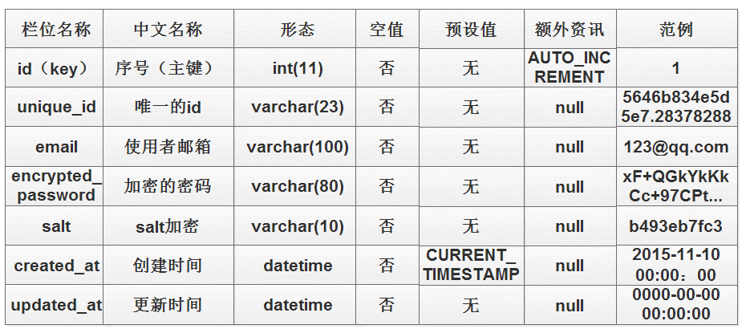

# 比价
比价 APP是基于 Android 系统开发的一款手机 应用软件。它主要是为了满足人们可以在快节奏的 生活中可以随时记下自己的消费情况、查看过去的 消费记录的需求，分析消费者的消费情况，预测商 品未来价格变化而设计制作.

## Technology Stack

- Java
- PHP
- MySql
- SQL
- MPAndroidChart
- Volley 

## Feature

* **价格分析**

    利用趋势平均数学模型预测商品未来价格

## Details
* **数据表**

    
    
    
    

* **截图**

    
    
    
    
    
